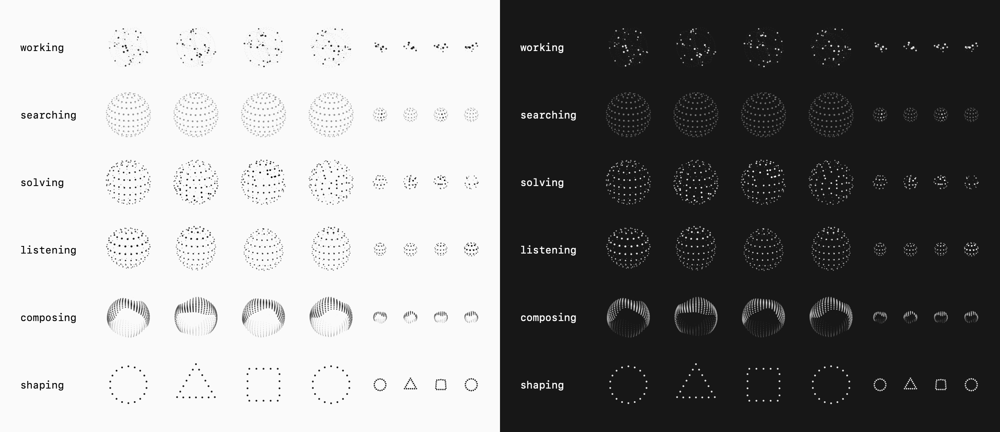

# ThinkingOrbs (Swift)

A Swift port of [thinking-orbs](https://github.com/Jakubantalik/thinking-orbs) —
dotted thought-orb loading indicators for AI / agent interfaces, with both
SwiftUI and AppKit front ends. The particle engine (projection, depth
shading, hashes, and all hand-tuned presets) is ported 1:1 from the original
TypeScript canvas implementation and draws into a `CGContext`, so both front
ends render identical frames: SwiftUI via `Canvas` + `TimelineView`, AppKit
via an `NSView` driven by a display link.



## States

| State | Animation |
|---|---|
| `working` | particles on tilted orbits |
| `searching` | a scan meridian sweeps a dotted globe |
| `solving` | bands scramble in quarter turns, then click back |
| `listening` | a waveform rolls through latitude rings |
| `composing` | an undulating multi-band sash |
| `shaping` | a dotted outline morphs circle → triangle → square |

## Usage

```swift
import ThinkingOrbs

ThinkingOrb(state: .working)                    // 64pt chat-avatar orb
ThinkingOrb(state: .searching, size: .px20)     // 20pt inline orb
ThinkingOrb(state: .solving, theme: .dark)      // pin the palette
ThinkingOrb(state: .composing, speed: 1.5)      // speed multiplier
ThinkingOrb(state: .shaping, paused: true)      // freeze on current frame
```

As in the original, `64` and `20` are two separately tuned designs (own dot
counts, radii and speeds), not a scale factor. Theme `auto` follows the
SwiftUI environment color scheme; dark renders light ink for dark backgrounds,
light renders dark ink. The canvas background is transparent.

`ThinkingOrbFrame(state:size:theme:time:)` renders one deterministic frame,
for previews, snapshot tests or widgets.

### AppKit

```swift
let orb = ThinkingOrbView(state: .working)              // 64pt orb
let inline = ThinkingOrbView(state: .searching, orbSize: .px20)
orb.speed = 1.5
orb.paused = true
```

`ThinkingOrbView` sizes itself via `intrinsicContentSize` (centering the orb
if given a larger frame), follows `effectiveAppearance` when `theme` is
`.auto`, and stops its display link automatically while windowless, hidden or
in a fully occluded window.

Faithful to the original's behavior: all mounted orbs — SwiftUI and AppKit
alike — share one clock and stay in phase, and Reduce Motion shows a static
representative frame that still follows the live theme. Requires iOS 15+ /
macOS 13+ (SwiftUI); the AppKit view is macOS-only.

## Demo

```sh
swift run ThinkingOrbsDemo                    # live gallery, both sizes, controls
swift run ThinkingOrbsDemo --snapshot out     # render static frames to out.png
```

## Installation

Add the package in Xcode (File → Add Package Dependencies…) or in `Package.swift`:

```swift
.package(url: "https://github.com/everlof/thinking-orbs-swift.git", from: "1.0.0")
```

## License

MIT — same as the original. All animation design and tuning credit goes to
[Jakub Antalik](https://github.com/Jakubantalik)'s
[thinking-orbs](https://github.com/Jakubantalik/thinking-orbs); this package is
a faithful Swift/SwiftUI port of that engine.
